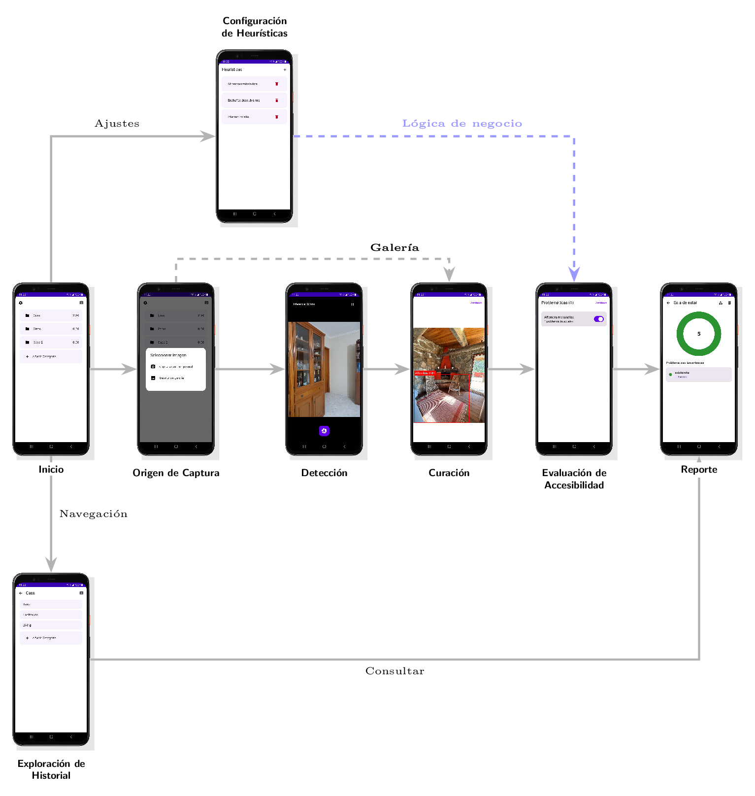
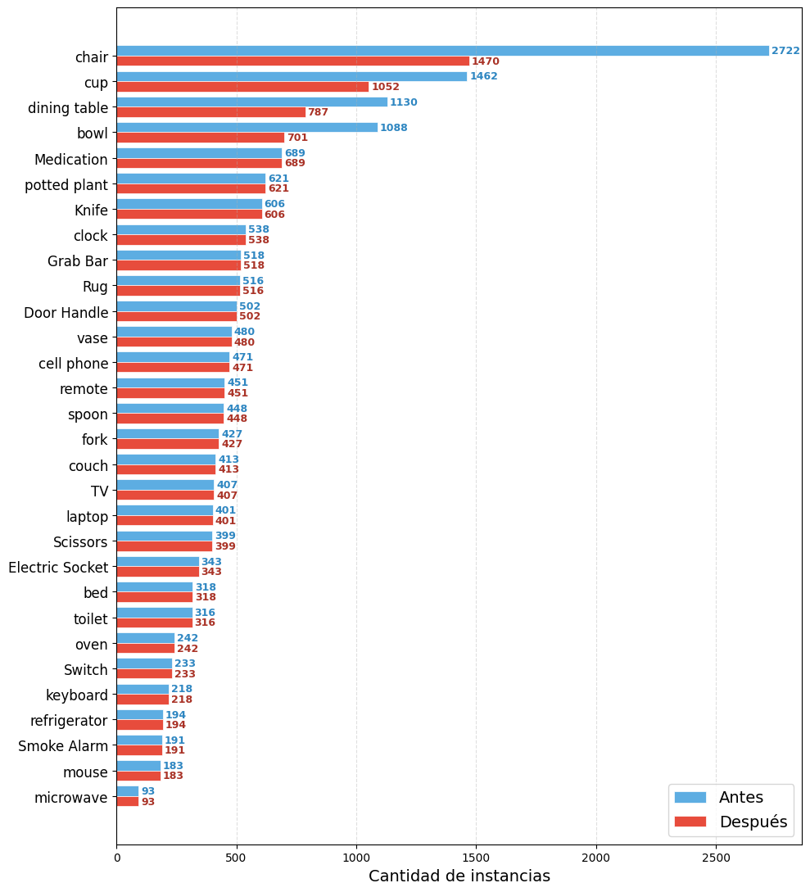
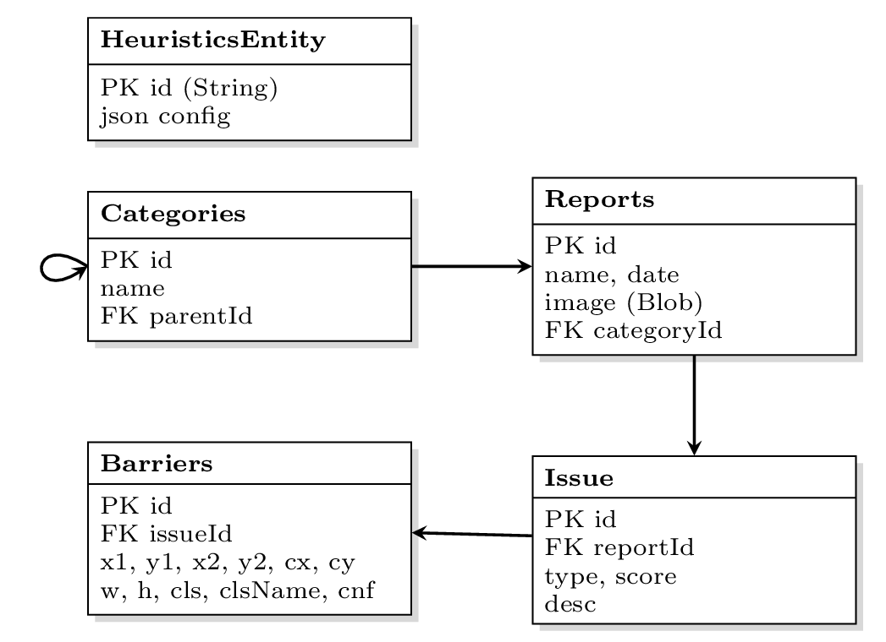
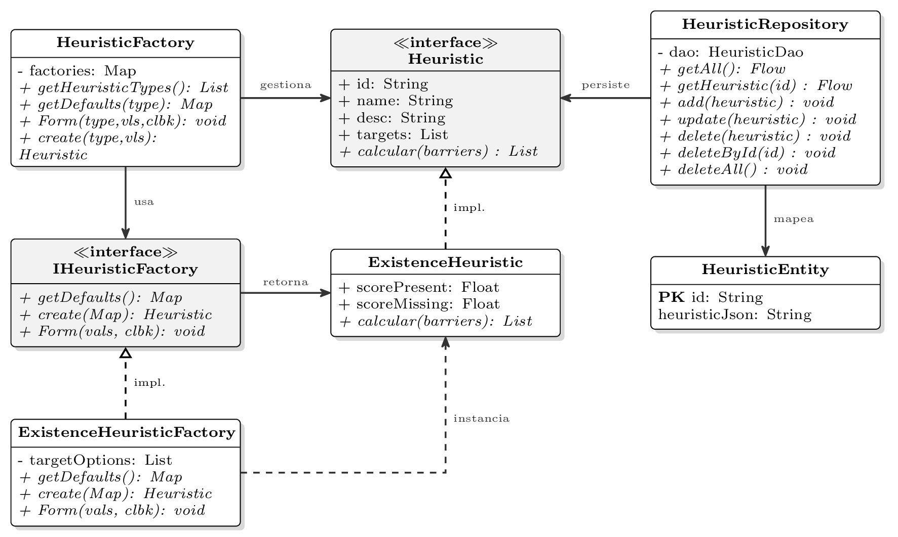

<h1>AccesibiliApp</h1>

  

<h1> Resumen </h1>
El objetivo principal es desarrollar un método automatizado para la evaluación de la accesibilidad en espacios interiores frecuentados por adultos mayores, utilizando imágenes y técnicas de reconocimiento de objetos, con el fin de identificar barreras que afecten su movilidad y autonomía.

Específicamente, la propuesta busca:
- Analizar los factores determinantes de la accesibilidad en espacios interiores para adultos mayores.
- Implementar un sistema automatizado basado en visión por computadora y heurísticas personalizadas para la detección de obstáculos.
- Generar reportes claros que faciliten la identificación de oportunidades de mejora en los espacios evaluados, promoviendo así una trayectoria de envejecimiento saludable.

<h1>Contexto</h1>

Click para Expandir

El envejecimiento es un proceso complejo y no lineal, fuertemente influenciado por el ambiente y el comportamiento del individuo. Demográficamente, la población de adultos mayores se encuentra en un proceso de crecimiento acelerado. En Argentina, este grupo etario ya representa el 11.9% de la población total, y se proyecta que para 2040 alcance el 20%. A nivel global, esta transición demográfica pone presión sobre los sistemas actuales y exige un cambio de paradigma en cómo concebimos la vejez.

Ante este panorama, la OMS propone el concepto de **envejecimiento saludable**, definido como el proceso de desarrollar y mantener las habilidades funcionales en la vejez. Este bienestar depende de la interacción entre la **capacidad intrínseca** de la persona (condiciones físicas y mentales) y **el entorno** (factores sociales, económicos y ambientales). Idealmente, el declive de la capacidad intrínseca debería amortiguarse mediante entornos adecuados que favorezcan la autonomía.

En la práctica, la dimensión física de esta adaptación se traduce en la **accesibilidad de un espacio**, la cual impacta de forma directa en la calidad de vida de los adultos mayores. A nivel local, Argentina presenta un déficit habitacional cualitativo que se refleja en viviendas antiguas que carecen de estas condiciones de accesibilidad.

La problemática específica radica en que los métodos tradicionales para auditar y evaluar la accesibilidad de interiores requieren esfuerzo manual e inspecciones presenciales por parte de terapistas ocupacionales. Esta falta de estandarización y la necesidad de intervención especializada dificultan severamente la implementación de mejoras y evaluaciones a gran escala.

<h1>Pipeline de Detección</h1>

Click para Expandir

<h2>Preprocesamiento</h1>
Debido a la escasez de conjuntos de datos específicos de accesibilidad en interiores, se construyó un dataset propio integrando fuentes de dominio público con datos especializados. La gestión, visualización y filtrado del conjunto se realizó utilizando la herramienta de código abierto Voxel51 FiftyOne.

Se combinaron dos fuentes:
- **COCO-2017**: Dataset de uso frecuente en visión computacional. Se extrajeron únicamente clases relacionadas con interiores (ej. *chair, couch, bed, toilet, microwave*).
- **RASSAR**: Dataset especializado en auditoría de accesibilidad. Aportó clases no presentes en COCO, tales como alfombras (*rug*), barras de sujeción (*grab bar*) y configuraciones de puertas.

Los datos se sometieron al siguiente proceso de preprocesamiento:
1. **Filtrado de etiquetas**: Se eliminaron las anotaciones de COCO que no pertenecían a la lista de clases objetivo.
2. **Homogeneización de clases**: Se unificó la nomenclatura mediante un *remapping* para resolver inconsistencias de mayúsculas o sinónimos.
3. **Undersampling**: Se detectó un desbalance de clases. Se descartaron muestras compuestas exclusivamente por clases mayoritarias para equilibrar el conjunto, sin eliminar etiquetas en imágenes mixtas.

  

<h2>Entrenamiento</h2>
Se utilizó YOLO (You Only Look Once), un modelo de inteligencia artificial diseñado para la detección de objetos en tiempo real. Se seleccionó la arquitectura YOLOv8 Nano (yolov8n) debido a que presenta la menor cantidad de parámetros de su familia, para garantizar la baja latencia y los tiempos de respuesta exigidos para una aplicación móvil.

En cuanto a la gestión de datos, el dataset se fragmentó en una distribución estratégica de 70% para entrenamiento, 20% para validación y 10% para pruebas. Finalmente, el proceso se ejecutó en el entorno de Google Colab utilizando una GPU NVIDIA Tesla T4 y el framework de Ultralytics. Bajo esta configuración, el entrenamiento alcanzó su convergencia tras un ciclo de 50 épocas, completando el proceso en un tiempo total de 1.59 horas.

<h2>Analisis de Resultados</h2>
El desempeño del modelo se cuantificó mediante la métrica mAP (Mean Average Precision), evaluando tanto la precisión global como el comportamiento específico según la categoría de los objetos. En cuanto a los indicadores generales de rendimiento, el sistema alcanzó un valor de 0.793 en la métrica mAP@50. Al aplicar el criterio más restrictivo de mAP@50-95, el cual promedia la precisión en diversos umbrales de intersección para el ajuste de las cajas delimitadoras, el resultado obtenido fue de 0.633.

Se destaca la relación entre las dimensiones del objeto y la precisión de la detección. Las categorías de mayor dimensión física y morfología definida registraron los valores más altos; específicamente, las clases *Bed*, *TV* y *Toilet* superaron un mAP@50-95 de 0.817. Por el contrario, se registraron valores inferiores en objetos de pequeña escala o geometría delgada, obteniendo resultados de 0.464 para *Switch*, 0.481 para *Elec. Socket* y 0.418 para la clase *Remote*.

<h1>Arquitectura de la Aplicación Móvil</h1>

Click para Expandir

La arquitectura del proyecto se alinea con la guía oficial de Android, priorizando la separación de responsabilidades y el manejo reactivo de datos. Debido a que el proyecto inicial es un prototipo se optó por obviar la capa de dominio para no realizar abstracciones prematuras que empeoren la modificabilidad del código a largo plazo y trabajar solo en dos niveles:
- **Capa de UI**: Implementa un patrón de Flujo de Datos Unidireccional. En este esquema, la vista reacciona a los cambios de estado emitidos por los ViewModels, logrando un desacoplamiento efectivo entre la lógica de visualización y la gestión del estado.
- **Capa de datos**: Centraliza el acceso a fuentes de información locales.

<h2>Detección</h1>

La obtención de imágenes se realiza desde la cámara en tiempo real o desde la galería, un proceso coordinado por el ViewModel para normalizar los datos antes de la detección. En el modo en vivo, el sistema descarta los fotogramas excedentes si el detector está ocupado, sincronizando así la velocidad del hardware con la de inferencia.

Una vez obtenidos los datos, el modelo, entrenado en el pipeline detallado en la sección anterior, se ejecuta localmente para la inferencia mediante \textbf{TensorFlow Lite}. Esto permite utilizar el hardware del dispositivo para optimizar tanto la privacidad como la latencia. El proceso se divide en tres etapas:

- **Pre-procesamiento**: Se escalan las dimensiones de la imagen de entrada a la esperadas por el modelo y normaliza los pixeles en rango `[0,1]`. Esto asegura que los datos sean compatibles con el formato de la biblioteca
- **Inferencia**
- **Post-procesamiento**: Los modelos de detección suelen generar múltiples cuadros para un mismo objeto, se implementó el algoritmo Non-Maximum Suppression (NMS). Su función es refinar la salida mediante dos pasos críticos:
	- **Filtrado por Confianza**: Se descartan de inmediato todas las detecciones que no alcancen un umbral de certeza del 80%, eliminando el ruido visual y las predicciones débiles.

    - **Supresión por IoU**: Para las cajas restantes que se superponen, el algoritmo calcula la Intersection over Union (IoU), que es el cociente entre el área de intersección y el área de unión de dos cuadros. Si el IoU supera el 70%, el sistema asume que ambas cajas identifican al mismo objeto y elimina la de menor confianza, dejando una única detección limpia por cada elemento real.

Por fuera de la inferencia, el sistema integra una **etapa de curación** de datos que actúa como un mecanismo de validación humana para reducir falsos positivos. Los resultados de la inferencia se mantienen como datos volátiles en memoria, permitiendo al usuario activar o desactivar detecciones manualmente antes de que la información sea procesada por las heurísticas.

<h2>Modelado de Datos</h2>

  

El modelo de datos estructura los resultados de las inferencias visuales y los organiza jerárquicamente para su evaluación. La entidad `Report` centraliza la información descriptiva y el blob de la imagen capturada. Al almacenarse una única vez, todas las problemáticas detectadas en una captura referencian a la misma evidencia visual, lo que evita la duplicidad de la imagen en la base de datos.

Para representar los hallazgos, el esquema separa la información geométrica de la semántica mediante las entidades `Barrier` e `Issue`. La entidad `Barrier` almacena los datos espaciales del objeto detectado utilizando coordenadas relativas, aislando la ubicación física de su interpretación de accesibilidad. Por su parte, `Issue` representa la salida del procesamiento de las heurísticas y asocia una o varias barreras con un problema específico y su puntaje de impacto. Este desacoplamiento permite que un obstáculo físico sea reevaluado bajo distintos criterios sin alterar los datos espaciales de origen.

La evaluación de las problemáticas se apoya en `HeuristicEntity`, que persiste la configuración de las reglas de negocio. Esta entidad utiliza un esquema de almacenamiento basado en JSON que admite la coexistencia de múltiples lógicas de cálculo polimórficas en una única tabla, posibilitando la incorporación de nuevas reglas sin requerir modificaciones en el esquema SQL.

Finalmente, la entidad `Category` implementa una relación de autorreferencia para proveer contexto espacial a las evaluaciones. Esta estructura genera un árbol de directorios de profundidad variable que agrupa los reportes. A través de este diseño, el sistema consolida los registros y calcula métricas de accesibilidad promediadas de forma ascendente, mapeando la jerarquía del entorno físico evaluado. Dado que un único reporte resulta insuficiente para analizar la accesibilidad de un espacio en su totalidad, esta entidad permite agrupar múltiples evaluaciones bajo un mismo contexto.

<h2>Sistema de Heuristicas</h2>

  

Las heurísticas definidas por el usuario sirven para convertir las detecciones curadas en posibles problemáticas de accesibilidad dentro del entorno. El propósito de cada heurística es asignar un valor de impacto en la accesibilidad basándose en la relación de los objetos detectados. Por ejemplo: para una persona mayor, una bañera sin barral de agarre tiene un potencial impacto negativo, lo cual difiere significativamente si se detecta la combinación de bañera más el agarre.

La característica central del sistema es la configurabilidad de las reglas según el perfil del usuario. Dado que una barrera arquitectónica no afecta de igual manera a todas las personas, cada usuario define su propio esquema de puntuación para cada regla. Por ejemplo, en una heurística de existencia, es posible configurar un puntaje negativo ante la detección de un obstáculo o un puntaje positivo ante la presencia de un facilitador (como una rampa).

El tipo de heurística define la semántica de evaluación; no es lo mismo evaluar ante la mera existencia de un objeto que ante la relación espacial entre varios objetos. Por este motivo, en la implementación del sistema se puso énfasis en la fácil extensibilidad, para que la incorporación de nuevas lógicas de evaluación sea directa. Solo se requiere la implementación de la interfaz `Heuristic` y su correspondiente `Factory` para la generación dinámica de la interfaz de usuario. Las reglas se almacenan en formato JSON dentro de la base de datos, lo que facilita la evolución del sistema sin alterar el esquema de tablas SQL existente.

Adicionalmente, se agrega una **etapa de filtrado post-aplicación de las heurísticas** sobre el listado de problemáticas resultantes. En esta instancia, el usuario puede descartar las problematicas generadas antes de la creación final del reporte. Esto permite contextualizar los resultados, eliminando alertas que, si bien son técnicamente correctas según la regla, pueden no ser relevantes para el entorno específico evaluado.

